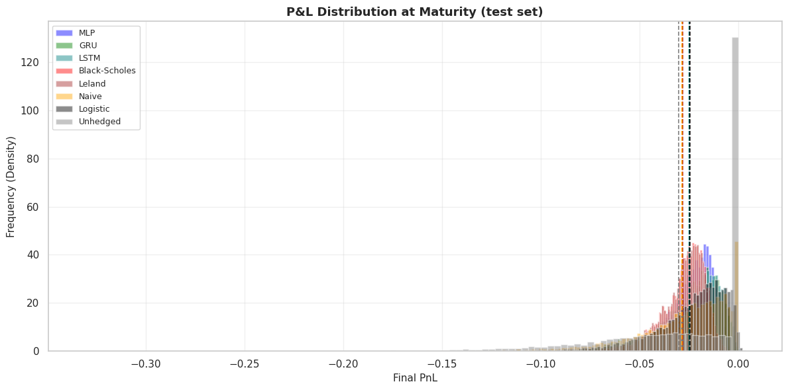
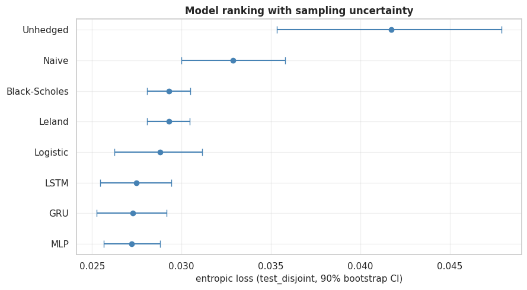
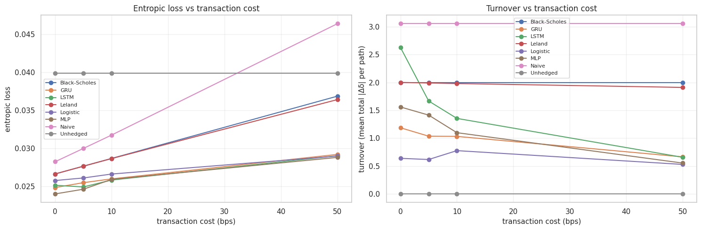
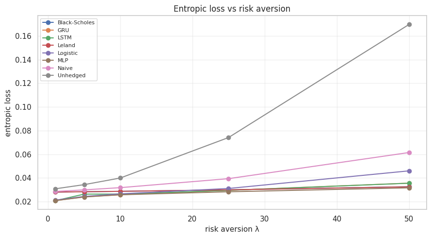

# Deep Hedging: Neural Networks vs. Black–Scholes

**Can a neural network learn to hedge an option better than the Greeks?** This project trains three architectures (MLP, GRU, LSTM) to hedge a 30-day at-the-money call directly from data — minimizing a risk measure of terminal P&L rather than differentiating a pricing formula — and benchmarks them out-of-sample against Black–Scholes, Leland's transaction-cost correction, a naive intrinsic-value hedge, and a logistic-regression control.

Under realistic transaction costs, all three learned hedgers **beat Black–Scholes on risk-adjusted P&L, out of sample, with the gap confirmed by bootstrapped confidence intervals** — and they do it by learning *when trading isn't worth the fee*, not by predicting price direction.

[](https://www.python.org/)
[](https://www.tensorflow.org/)
[](LICENSE)

**[Full technical report (PDF)](docs/Deep_Hedging_Explanation_Paper.pdf)** — theory, derivations, and complete results
**[Notebook](Deep_Hedging_Notebook.ipynb)** — end-to-end implementation

---

## Table of Contents
- [Highlights](#highlights)
- [Problem Setup](#problem-setup)
- [Data](#data)
- [Models](#models)
- [Results](#results)
  - [Is the gap real, or sampling noise?](#is-the-gap-real-or-sampling-noise)
- [Robustness Checks](#robustness-checks)
- [Repository Structure](#repository-structure)
- [Getting Started](#getting-started)
- [Tech Stack](#tech-stack)
- [Team](#team)
- [References](#references)

---

## Highlights

- **Beats the textbook model, honestly.** Out-of-sample entropic loss: **MLP 0.0258** vs. **Black–Scholes 0.0287** (lower is better), with all three neural hedgers strictly dominating both Black–Scholes and its Leland transaction-cost correction.
- **Statistically validated, not just a lucky seed.** Test windows overlap (29/30 days shared between consecutive samples), so a naive confidence interval would understate the uncertainty. We block-bootstrap on 320 strictly disjoint windows and report honest 90% CIs — the deep hedgers' intervals sit clearly below the classical baselines'.
- **The network learns to trade less when trading is expensive** — without being told to. As transaction costs rise from 0 to 50 bps, MLP/GRU/LSTM turnover drops by up to ~75%, while Black–Scholes keeps rebalancing at a fixed rate because its formula has no notion of cost.
- **A linear control isolates where the edge comes from.** A logistic-regression hedger sees the exact same inputs and objective as the MLP but with one linear layer instead of two ReLU layers — it beats the classical models but trails the deep ones, showing the gap isn't just "any learned model beats a formula."
- **No shortcuts on methodology.** Strict time-ordered train (2006–2019) / validation (2020–2021) / test (2022–2025) split; all hyperparameters (width, learning rate, epochs) selected on the validation set via grid search with early stopping, never on the test set.

## Problem Setup

At $t_0$ we sell a 30-day at-the-money European call ($K = S_0$). At each trading day $t$, the network observes the market state and outputs a hedge ratio $\delta_t \in [0,1]$ — the fraction of the underlying to hold. The terminal P&L is:

$$
\text{PnL}_T = \sum_{t=0}^{T-1} \delta_t (S_{t+1} - S_t) \;-\; \sum_{t=0}^{T-1} c\,|\delta_t - \delta_{t-1}|\,S_t \;-\; \max(S_T - K, 0)
$$

where $c = 10$ bps is the proportional transaction cost. There is no "correct" $\delta_t$ to regress against, so the network is trained on a **risk measure of the P&L distribution** instead of a pointwise loss. Following Buehler et al. (2019), we use the entropic risk measure:

$$
\rho(X) = \frac{1}{\lambda} \log \mathbb{E}\big[\exp(-\lambda X)\big]
$$

whose optimal value is the exponential-utility indifference price of the option, and which is computed via a numerically-stable `logsumexp` to avoid overflow in training. $\lambda$ (risk aversion, default 10) controls how harshly the loss punishes tail losses.

## Data

- **18 instruments** via `yfinance`: broad-market (SPY, QQQ, DIA, IWM), U.S. sector ETFs (XLK, XLF, XLV, XLY, XLP, XLE, XLI, XLB, XLU), and international trackers (EWG, EWJ, EWL, FXI, EEM) — Jan 2006 to Dec 2025.
- **Sliding-window trajectories**: every 31-day sequence per instrument, normalized so $S_0 = 1.0$ (making the strike ATM by construction and the strategy scale-independent) → **~90,000 trajectories**.
- **Time-ordered split** to prevent leakage — the validation and test sets are never touched during training or model selection until the moment they're needed:

  | Split | Period | Used for |
  |---|---|---|
  | Train | 2006–2019 | Gradient updates |
  | Validation | 2020–2021 | Hyperparameter grid search + early stopping |
  | Test | 2022–2025 | Final out-of-sample comparison (touched once) |

- **Stylized facts confirmed in the EDA** (fat tails, volatility clustering, leverage effect — see the notebook and paper §3) motivate why a constant-volatility Gaussian model like Black–Scholes is structurally mismatched to the data the hedgers actually see.

## Models

| Architecture | Inputs | Layers | Trainable params |
|---|---|---|---|
| **MLP** | $(\delta_{t-1}, S_t, \tau_t)$ per step | Dense(16, ReLU) → Dense(16, ReLU) → Dense(1, Sigmoid) | 1,217 |
| **GRU** | $(S_t, \tau_t)$, full 30-step sequence | GRU(64, return_sequences) → Dense(1, Sigmoid) | ~3.5k |
| **LSTM** | $(S_t, \tau_t)$, full 30-step sequence | LSTM(16, return_sequences) → Dense(1, Sigmoid) | ~3.5k |

The MLP is a single shared network reapplied at every step (same weights, no per-timestep parameters); the recurrent models process the whole path in one vectorized forward pass and carry the hedge memory in their hidden state, so they don't need the previous position as an explicit input.

**Baselines:** Unhedged ($\delta \equiv 0$), Naive intrinsic-value ($\delta_t = \mathbb{1}\{S_t > K\}$), Logistic regression (same features/objective as the MLP, one linear layer), Black–Scholes ($\delta_t = \Phi(d_1)$, historical volatility), and Leland's transaction-cost-adjusted Black–Scholes.

**Model selection:** grid search over learning rate $\{3\text{e-}4, 1\text{e-}3, 3\text{e-}3\}$ × width $\{16, 32, 64\}$ per architecture (27 configurations), early-stopped on validation entropic loss (patience 5, max 30 epochs), each architecture tuned independently:

| Architecture | Width | Learning Rate | Epochs (early-stopped) |
|---|---|---|---|
| MLP | 16 | 0.003 | 12 |
| GRU | 64 | 0.0003 | 11 |
| LSTM | 16 | 0.003 | 3 |

## Results

Out-of-sample performance on the test set (2022–2025), $c=10$ bps, $\lambda=10$:

| Model | Mean PnL | Entropic Loss ↓ | Std. Dev. | CVaR (95%) |
|---|---:|---:|---:|---:|
| **MLP** | -0.0248 | **0.0258** | 0.0133 | 0.0624 |
| GRU | -0.0248 | 0.0262 | 0.0161 | 0.0687 |
| LSTM | -0.0246 | 0.0261 | 0.0167 | 0.0714 |
| Logistic | -0.0243 | 0.0265 | 0.0195 | 0.0799 |
| Black–Scholes | -0.0280 | 0.0287 | 0.0118 | 0.0600 |
| Leland | -0.0279 | 0.0287 | 0.0118 | 0.0597 |
| Naive | -0.0282 | 0.0318 | 0.0248 | 0.0986 |
| Unhedged | -0.0300 | 0.0399 | 0.0390 | 0.1410 |



The neural hedgers keep the P&L distribution tighter and closer to zero than the classical baselines — visible in the taller, less spread-out histograms above.

### Is the gap real, or sampling noise?

Because 30-day test windows overlap by 29 days, treating them as independent would understate the uncertainty. We re-run the comparison on 320 **strictly disjoint** windows and bootstrap a 90% confidence interval for each strategy's entropic loss:

| Model | Entropic Loss | 90% CI |
|---|---:|---|
| **MLP** | 0.02722 | [0.02565, 0.02882] |
| GRU | 0.02729 | [0.02526, 0.02915] |
| LSTM | 0.02747 | [0.02545, 0.02942] |
| Logistic | 0.02880 | [0.02624, 0.03116] |
| Leland | 0.02929 | [0.02806, 0.03047] |
| Black–Scholes | 0.02931 | [0.02807, 0.03049] |
| Naive | 0.03288 | [0.03001, 0.03581] |
| Unhedged | 0.04172 | [0.03534, 0.04790] |



The MLP/GRU/LSTM confidence intervals sit clearly below Black–Scholes and Leland's — the outperformance survives honest resampling, not just a favorable single split.

## Robustness Checks

Rather than reporting a single lucky configuration, every learned model is **retrained from scratch** at each point of three sensitivity sweeps to check whether the ranking depends on assumptions we otherwise held fixed:



**Transaction costs (0–50 bps):** as fees rise, entropic loss rises for everyone — but turnover for the learned hedgers *falls* (MLP: 1.56 → 0.55 total turnover; GRU: 1.19 → 0.66), while Black–Scholes stays pinned near 2.0 regardless of cost because its formula has no way to trade less. Leland's theoretical fix for this barely moves the needle (2.00 → 1.91).



**Risk aversion ($\lambda$ from 1 to 50):** at low-to-moderate risk aversion, all learned models beat the classical baselines by a wide margin (λ=1: MLP 0.0208 vs. Black–Scholes' 0.0280). Under extreme risk aversion, the recurrent models' cost-saving bias becomes a liability and they're overtaken by Black–Scholes — but **the MLP alone stays ahead of every baseline across the entire range**, including λ=50 (0.0316 vs. Black–Scholes' 0.0326).

**Maturity (10–60 days):** all three neural architectures keep a clear edge over Black–Scholes and Leland at every horizon tested, and the gap widens as maturity extends, since longer paths accumulate more transaction-cost drag for a strategy that can't adapt its trading frequency. Interestingly, the logistic-regression control stays competitive throughout and edges out the neural nets at the 60-day horizon (0.0351 vs. MLP's 0.0355) — a sign that a simple cost-aversion rule captures most of what's needed over long, low-turnover hedges.

Full tables for all three sweeps are in the [paper](docs/Deep_Hedging_Explanation_Paper.pdf), §13.

## Repository Structure

```
deep-hedging/
├── Deep_Hedging_Notebook.ipynb   # End-to-end notebook: EDA → training → evaluation → sweeps
├── src/
│   ├── data_loader.py   # yfinance download + sliding-window trajectory construction
│   ├── models.py        # MLP / GRU / LSTM / logistic architectures + feature maps
│   ├── metrics.py       # Entropic loss (stable logsumexp), CVaR
│   ├── Baselines.py     # Unhedged, naive, Black-Scholes, Leland
│   ├── Train.py         # Training loops, TF graph steps, retraining for sweeps
│   └── Evaluation.py    # P&L evaluation, bootstrap CI, delta-path extraction
├── docs/
│   └── Deep_Hedging_Explanation_Paper.pdf   # Full write-up: theory, derivations, all results
├── assets/                       # Exported figures used in this README
├── requirements.txt
└── README.md
```

> The notebook expects a sibling `src/` folder on the Python path (`sys.path.append('./src')`), so run it from the repository root — including on Google Colab, after mounting/cloning the repo so `src/` sits next to the notebook.

## Getting Started

```bash
git clone https://github.com/<your-username>/deep-hedging.git
cd deep-hedging
python -m venv .venv && source .venv/bin/activate   # optional but recommended
pip install -r requirements.txt
jupyter notebook Deep_Hedging_Notebook.ipynb
```

**On Google Colab:** upload or clone the repo so that `Deep_Hedging_Notebook.ipynb` and `src/` are siblings, then run cells top to bottom. Data is pulled live from Yahoo Finance, so the first run needs internet access. The full notebook — including the 27-run hyperparameter grid search and the three retraining sweeps — takes a while on CPU; a GPU runtime speeds up the recurrent-model training noticeably.

## Tech Stack

`Python` · `TensorFlow / Keras` · `NumPy` · `Pandas` · `yfinance` · `scikit-learn` · `SciPy` · `Matplotlib` · `Seaborn`

## Team

This was a group project, completed together by Riccardo Ravelli, Andrea Rossini, Alessio Scrazzolo, Guido Torrisi, and Mattia Zanin.

## References

1. Black, F., & Scholes, M. (1973). The pricing of options and corporate liabilities. *Journal of Political Economy*, 81(3), 637–654.
2. Merton, R. C. (1973). Theory of rational option pricing. *The Bell Journal of Economics and Management Science*, 4(1), 141–183.
3. Buehler, H., Gonon, L., Teichmann, J., & Wood, B. (2019). Deep hedging. *Quantitative Finance*, 19(8), 1271–1291.
4. Leland, H. E. (1985). Option pricing and replication with transaction costs. *The Journal of Finance*.
5. Mazars (2023). Deep Learning for Hedging: A Practitioner's Perspective.
